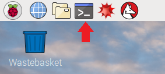

## Oh no! A command line interface!

Boot up your Raspberry Pi and open a terminal window:

`pi@raspberrypi ~ $ _`

The text above is the command prompt. Try not to be afraid of it!  A CLI (command line interface) is actually a very quick and efficient way to use a computer.

To start, enter the command below to navigate to the `hello_pi` folder where all the demos are stored. **TIP**: You can use the `TAB` key for auto-complete as you enter commands.

`cd /opt/vc/src/hello_pi`

The command prompt should now look like this. The blue part shows where you are in the file system of the Pi.

`pi@raspberrypi /opt/vc/src/hello_pi $ _`

If you enter `ls` and press `enter`, you’ll see a list of folders. There is one for each demo. Before you can run them though, they must be compiled. Don’t worry if you don’t understand why you need to do this; just go along with it for now, and we'll learn more about it later on.

There is a small shell script supplied in the `hello_pi` folder called `rebuild.sh`, which will do the compile for you. Enter the following command to run it. Ignore the gobbledygook for now!

`./rebuild.sh`

A lot of text will scroll up the screen now, but for this exercise you can ignore it. It is just the output of the compiler as it works through the demo code. Wait for the command prompt to return before you continue.

Now we’re ready to run some demos.

